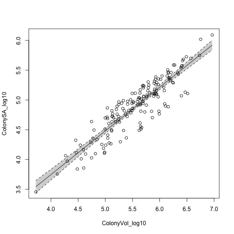

# Dawn's analysis


First I load the data:
```{r load_data, echo=FALSE}
data <-read.csv("data/3DLaserScannedColonies.csv", as.is=TRUE)
#head(data)
```

I take a look at ColonySA:

```{r exploratory_plots, echo=FALSE}
hist(data$ColonySA)
boxplot(data$ColonySA)
plot(ColonySA ~ ColonyVol, data)
```

### Analysis of SA:Vol for corals:

```{r analysis}
#data transformation (log scaling):
data$ColonySA_log10 <- log10(data$ColonySA)
data$ColonyVol_log10 <- log10(data$ColonyVol)

#regression analysis:
mod <- lm(ColonySA_log10 ~ ColonyVol_log10, data)
summary(mod)
confint(mod)

write.csv(round(summary(mod)$coef, 3), "output/dawn_table.csv")
```

```{r plot, echo=FALSE}
#plot:
png("figs/dawn_figure.png") #opens png device to create image of plot
plot(ColonySA_log10 ~ ColonyVol_log10, data)

vols <- sort(data$ColonyVol_log10)
pred_SA <- predict(mod, list(ColonyVol_log10 = vols), interval = "confidence")

lines(vols, pred_SA[,1]) #[,1] choses first whole column
lines(vols, pred_SA[,2], lty=2) #lty =2 changes to dashed line
lines(vols, pred_SA[,3], lty=2)
polygon(c(vols, rev(vols)), c(pred_SA[,2], rev(pred_SA[,3])), border = NA, col = rgb(0,0,0,0.2))

dev.off() #closes png device IMPORTANT
```


