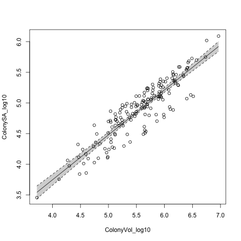

# Josh's analysis

First I load the data:

```{r load_data, echo=FALSE}
data <- read.csv("data/3DLaserScannedColonies.csv", as.is=TRUE)
# head(data)
```

I taje a look at ColonySA:

```{r exploratory_plots, echo=FALSE}
hist(data$ColonySA)
boxplot(data$ColonySA)
plot(data$ColonyVol, data$ColonySA)
plot(ColonySA ~ ColonyVol, data)
```

### Analysis of SA:Vol for corals. 

```{r analysis}
# Data transformation
data$ColonySA_log10 <- log10(data$ColonySA)
data$ColonyVol_log10 <- log10(data$ColonyVol)

# Regression analysis
mod <- lm(ColonySA_log10 ~ ColonyVol_log10, data)
summary(mod)
confint(mod)

write.csv(round(summary(mod)$coef, 3), "output/josh_table.csv")

```

```{r plot, echo=FALSE}
# Plot

png("figs/josh_figure.png")

plot(ColonySA_log10 ~ ColonyVol_log10, data)

vols <- sort(data$ColonyVol_log10)
pred_SA <- predict(mod, list(ColonyVol_log10 = vols), interval="confidence")

lines(vols, pred_SA[,1])
lines(vols, pred_SA[,2], lty=2)
lines(vols, pred_SA[,3], lty=2)
polygon(c(vols, rev(vols)), c(pred_SA[,2], rev(pred_SA[,3])), border=NA, col=rgb(0,0,0,0.2))

dev.off()

```


